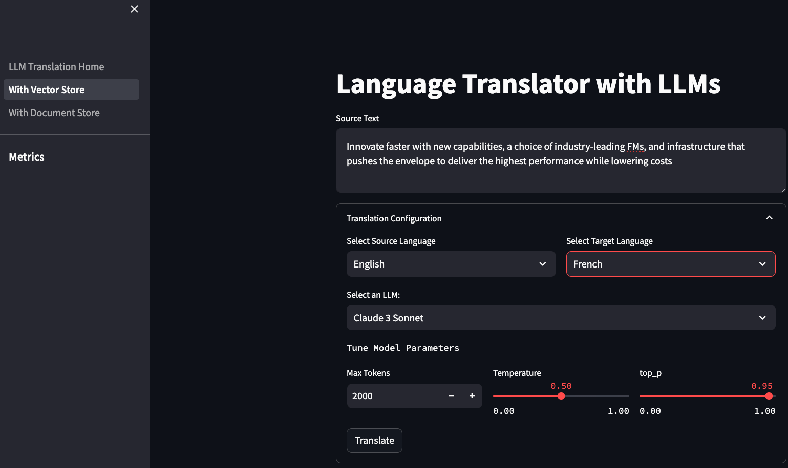

# LLM Translation Playground

Welcome to the LLM Powered Languague Transalation Playground.

## Table of Content

1. [Overview](#overview)
    - [Cost](#cost)
2. [Prerequisites](#prerequisites)
3. [Deployment Steps](#deployment-steps)
4. [Deployment Validation](#deployment-validation)
5. [Running the Application](#running-the-application)
6. [Cleanup](#cleanup)

## Overview

The LLM Transalation Playground is an experimentation tool for business personas and developers looking to assess the viability of using Foundation Models available in [Amazon Bedrock](https://aws.amazon.com/bedrock/) for their machine translation use cases.

LLM Transalation Playground can help you decide which machine translation technology (Neural MT or LLM-based MT) is better suited for your machine translation workload.

&nbsp;&nbsp;&nbsp;&nbsp;&nbsp;

### Features 🌟
This sample application allows you to chose from several languages, input a source text and translate it in real-time. It also presents a sample implementation of some key localization capabilities such as:
- Translation memory support (TMX or manually edited). 
- Customer terminology
- On-screen BLEU score assessment

You can choose from two options to enable the translation memory feature. Each option is available through its own page within the application:
- Vector Store using FAISS. In this mode the application processes the .tmx file you uploaded, indexes it and stores it locally into a vector store (FAISS) 
- Document Store using [Amazon OpenSearch Serverless](https://aws.amazon.com/opensearch/). You need to deploy the CDK stack included in the repository. Please note that only standard document search is supported. To test vector search, please use the Vector Store option

Please note that when uploading a TMX to the document store, a manual refresh may be needed for the new index to become available for selection from the dropdown.

### Cost

You are responsible for the cost of the AWS services used while running this Guidance. As of August 2024, the cost for running this Guidance with the default settings in the us-east-1 is approximately $176.62 per month. It is assumed that only one OpenSearch collection is deployed and redundant active replicas is disabled. Please note that you can reduce the cost of Amazon OpenSearch serverless by deleting your unused collections.

We recommend creating a [Budget](https://docs.aws.amazon.com/cost-management/latest/userguide/budgets-managing-costs.html) through [AWS Cost Explorer](https://aws.amazon.com/aws-cost-management/aws-cost-explorer/) to help manage costs. Prices are subject to change. For full details, refer to the pricing webpage for each AWS service used in this Guidance.

Please refer to the [Amazon Bedrock Pricing Page](https://aws.amazon.com/bedrock/pricing/) for more information on the cost per token for eeach model.

### Sample Cost Table

The following table provides a sample cost breakdown for deploying this Guidance with the default parameters in the US East (N. Virginia) Region for one month.

| AWS service  | Dimensions | Cost [USD] |
| ----------- | ------------ | ------------ |
| Amazon Bedrock - Anthropic Claude Sonnet 3.5 | 88k Input tokens, 22k Output tokens | $ 0.60 |
| Amazon Bedrock - Amazon Titan Embeddings v2| 1 million tokens | $ 0.02 |
| Amazon OpenSearch | 2 Indexing, 2 Query OCUs | $ 175.82 |

## Prerequisites

The project code uses the Python version of the AWS CDK ([Cloud Development Kit](https://aws.amazon.com/cdk/)). To execute the project code, please ensure that you have fulfilled the [AWS CDK Prerequisites for Python](https://docs.aws.amazon.com/cdk/latest/guide/work-with-cdk-python.html).

The project code requires that the AWS account is [bootstrapped](https://docs.aws.amazon.com/de_de/cdk/latest/guide/bootstrapping.html) to allow the deployment of the CDK stack. 

For building the lambda layer docker needs to be installed and running. 

### Operating System

These deployment instructions are optimized to best work on a Mac or Linux environment. Deployment in Windows may require additional steps for setting up required libraries and CLI. 

### Security requirements

The deployment code creates the appropriate role and policies on your behalf, following the least privileges principle. Ensure that the principal you run the application under has valid credentials and enough permissions to attach a policy to their role. Alternatively you may work with your Admin to attach the required policy to your principal.

Please note that the CDK deploys an OpenSearch Serverless data access policy for the collection and index it creates. It also creates a data access rule, granting permissions to the role specified in the CDK context JSON file.

### aws cdk bootstrap 

This Guidance uses aws-cdk. If you are using aws-cdk for first time, please perform the below bootstrapping....
``` cdk boostrap```

## Deployment Steps

1. Clone the repo using the command ```git clone https://github.com/aws-samples/llm-translation-playground.git```
2. Navigate to deployment directory ```cd llm-translation-playground```

3. install and activate a Python Virtual Environment

    ```python3 -m venv .venv```

    ```source .venv/bin/activate```

4. Install dependant libraries

```python -m pip install -r requirements.txt```

4. Install the application stack

```cd deployment/cdk```

Update the CDK Context Parameters by modifying ```cdk.context.json```
```
    "collection_name": "search-subtitles"
```
    1. collection_name: Amazon OpenSearch collection name
5. Run this command to deploy the stack ```cdk deploy```

## Deployment Validation

Open the AWS CloudFormation console and select the stack named OpsServerlessSearchStack. The status should read CREATE_COMPLETE. Select the Outputs tab and copy the value of OpenSearchEndpoint.

## Running the Application 💻

Before running the application, create a file named ```.env``` within the utils folder. Edit the file as follows:
- HOST (String): OpenSearch collection endpoint without the 'https'. Stack output: OpenSearchEndpoint
- OSS_PORT (Integer): OpenSearch endpoint port number. Default is 443
- ARR_ROLE_ARN: ARN of role cretaed by the CDK stack. The application will assume the role to access the OpenSearch index and the relevant Amazon Bedrock models. Stack output LLMTranslationPlaygroundAppRoleArn
- REGION (String): Region the collection was deployed into
- OSS_INGESTION_LIMIT (Integer): maximum amount of translation units per TMX file that can be ingested into the OpenSearch index
- FAISS_INGESTION_LIMIT (Integer): maximum amount of translation units per TMX file that can be ingested into the FAISS index

Run the application (make sure you are back into root folder)

```cd llm-translation-playground/source/```

```streamlit run LLM_Translation_Home.py```

## Cleanup

1. Navigate to deployment directory ```cd llm-translation-playground/deployment/cdk```
2. Run this command to cleanup ```cdk destroy```

## Known issues

Selection of a translation memory index from the dropdown menu in the customization panel may not be taken into account instantly. If this occurs you may need to unselect and re-select the item for the configuration to be reflected.

## License

This library is licensed under the MIT-0 License. See the LICENSE file.